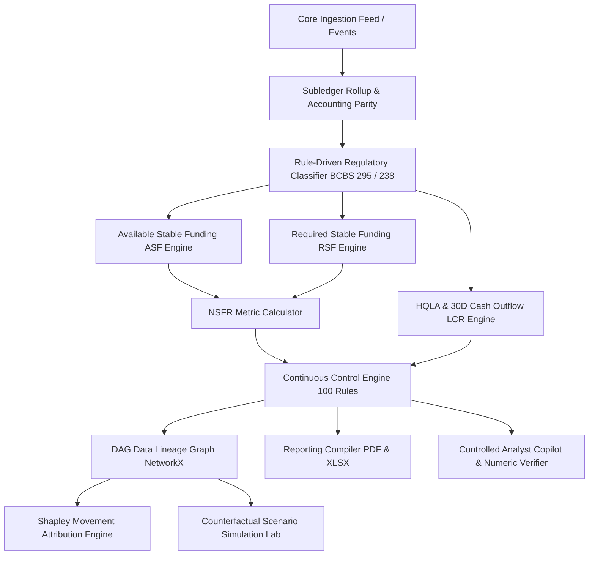

# Regulatory Liquidity Architecture Specification

**System**: Liquidity Twin — Regulatory Liquidity Digital Twin, Control Graph & Reporting Compiler  
**Classification**: Technical Reference Specification  

---

## 1. System Topology

The platform coordinates event-driven balance-sheet mutation, deterministic regulatory classification, continuous control execution, and publication-grade reporting packs:

---

## 2. Layer Responsibilities

### 2.1 Ledger & Ingestion Layer
- Consumes financial transaction records (`fact_event`).
- Maintains double-entry roll-forwards: $Closing = Opening + Inflows - Outflows$.
- Enforces balance-sheet identity: $Assets = Liabilities + Equity$ with zero tolerance.

### 2.2 Regulatory Engine Layer
- **Rule Classifier (`regulatory_rules`)**: Assigns Basel III regulatory factors based on instrument type, counterparty sector, contractual maturity, and encumbrance.
- **NSFR Engine**: Computes Available Stable Funding ($ASF$) and Required Stable Funding ($RSF$), outputting ratio $NSFR = (ASF / RSF) \times 100$.
- **LCR Engine**: Tiers liquid assets into Level 1, Level 2A, and Level 2B with haircuts and caps; aggregates 30-day cash outflows and applies the 75% inflow cap.

### 2.3 Continuous Control & Lineage Layer
- **Control Engine**: Runs 100 automated checks across Accounting, Data Quality, Classification, Maturity, Calculation, Reconciliation, Reporting, Lineage, Scenario, and AI Output families.
- **Lineage DAG**: Directed Acyclic Graph tracking nodes from source transactions to final report schedule cells. Supports backward audit extraction ("Metric Birth Certificate") and forward blast-radius analysis.

### 2.4 Decision Support & Reporting Layer
- **Movement Attribution**: Exact Shapley value decomposition attributing ratio movements to underlying balance-sheet drivers.
- **Scenario Lab**: Temporary sandbox calculating counterfactual stress tests without mutating baseline snapshots.
- **Reporting Compiler**: Generates regulatory PDF and XLSX packs with four-eye signatory blocks.
- **Analyst Copilot**: Allowlisted natural-language query interface backed by regex numeric verification.
